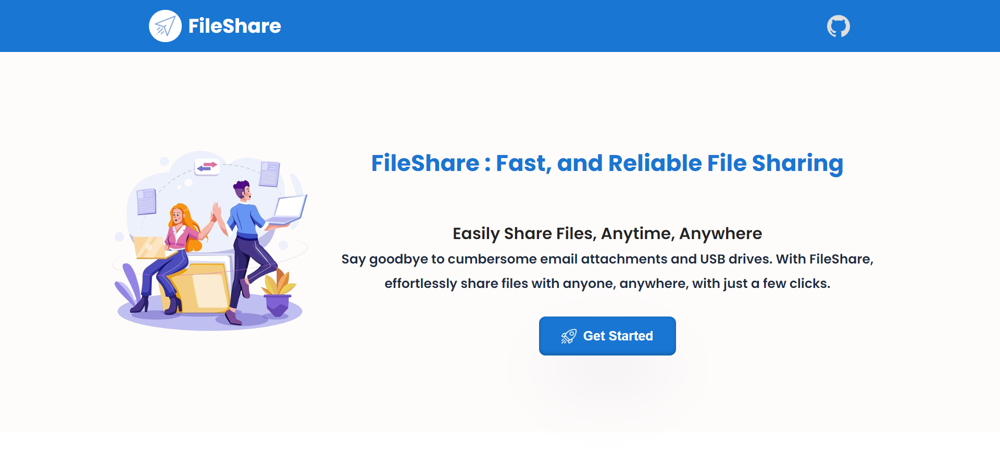

# FileShare.app - (File Sharing Website)


- ### File Sharing Application offers a streamlined and secure platform for users to upload files of various formats.

- ### With a user-friendly interface, individuals can effortlessly generate shareable links for their uploaded files, allowing recipients to access and download the content with ease.


## Key Features:

- ### Universal File Upload: 
    - Users have the flexibility to upload any type of file,      provided it does not exceed the size limit of 100MB.
    - Supported file formats include pdf,doc,exel,jpg,png,jpeg,videos,etc.

- ### Instant Shareable Links: 
    - Upon successful file upload, a unique, secure, and sharable link is automatically generated. 
    - This link acts as a direct gateway for recipients to access the uploaded file.

- ### Copy & Share Functionality:
    - Users can effortlessly copy the generated link with a single click, enabling them to share it across various platforms such as messaging apps, social media, or any preferred communication channel.

- ### Email Integration:
    - For added convenience, users have the option to directly email the generated link to their intended recipients.

- ### Secure Download Page:
    - Recipients directed to the download page encounter a secure environment designed to facilitate a smooth and secure downloading experience.

- ### User-Friendly Interface:
    - The application boasts an intuitive and user-centric design, ensuring that both uploaders and recipients can navigate the platform with ease.


## Tech Stack

### Client: React, HTML, CSS, Javascript, Axios

### Server: Node, Express, EmailJS

### Database: MongoDB


## Installation Steps

To run this project follow below steps:

#### Clone the repository
`git clone https://github.com/AmanPathan/FileShare.app.git`

#### Change the directory
`cd FileShare.app`

#### open two terminals and then
#### In first terminal install dependencies and Run 
```bash
cd server
npm i
node ./server.js
```

#### In second terminal install dependencies and Run
```
cd client
npm i
npm start
```

#### 🎉 Congratulations! You Have Successfully Run The Project 🎉
